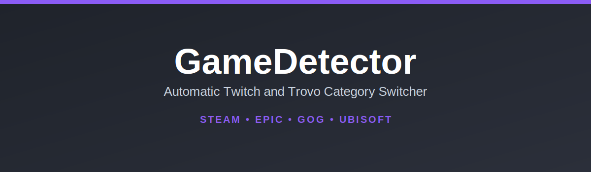

# Joypad to OBS

[](https://github.com/FabioZumbi12/joypad-to-obs/releases/latest) [](https://github.com/FabioZumbi12/joypad-to-obs/actions)

## Overview

**Joypad to OBS** is a powerful plugin that turns any connected gamepad, joystick, or even custom Arduino devices into a fully functional macro controller for OBS Studio.
 
This plugin **does not** provide a visual overlay for your controller. Its purpose is to use your controller as a remote control for OBS, allowing you to bind buttons and axes to actions like switching scenes, muting audio, and controlling media. It provides a physical, tactile way to manage your stream without needing a dedicated macro pad.

## Features

*   **Control OBS with Your Gamepad:** Map buttons and analog sticks to a wide range of OBS actions.
*   **Direct Hardware Access:** No intermediate software needed. The plugin communicates directly with any controller recognized by the operating system (e.g., in Windows' "joy.cpl" Game Controllers panel).
*   **Platform Support:** Primarily developed and tested for **Windows**. The code includes support for macOS and Linux, but it is currently untested and should be considered experimental.
*   **Broad Device Compatibility:**
    *   **Gamepads:** Works with XInput (Xbox), DirectInput (PlayStation, Logitech), and generic USB controllers.
    *   **Custom Hardware:** Compatible with **Arduino-based devices** that appear as a standard joystick, allowing you to use potentiometers, encoders, and sliders to control OBS.
*   **Extensive Action List:**
    *   **Scene Management:** Switch to any scene.
    *   **Source Control:** Toggle or set the visibility of sources.
    *   **Audio Control:** Mute/unmute sources, set absolute volume (dB), or adjust volume incrementally.
    *   **Analog Sliders:** Use an analog stick or a physical slider to control source volume with a configurable response curve (gamma).
    *   **Filter Control:** Enable or disable filters on any source.
    *   **Media Source Control:** Play, pause, restart, or stop media sources.
*   **Intuitive UI:** A dedicated "Tools" menu dialog to create, edit, and manage all your bindings.
*   **"Learn" Mode:** Simply press a button or move an axis on your controller to assign it to an action.

## Requirements

*   **OBS Studio:** Version 28 or newer.
*   **Operating System:** Windows 10/11, macOS, or a modern Linux distribution.

## How to Use

1.  **Install the plugin:** Download the latest release and copy the files to your OBS Studio plugins directory.
    *   **Windows:** `C:\Program Files\obs-studio\obs-plugins\64bit\`
    *   **macOS:** `~/Library/Application Support/obs-studio/plugins/`
    *   **Linux:** `~/.config/obs-studio/plugins/`
2.  **Open the configuration window:** In OBS, go to the **Tools** menu and select **Settings for Joypad to OBS**.
3.  **Add a new binding:**
    *   Click the **"Add Command"** button.
    *   Click **"Listen"** and press the button or move the axis on your controller that you want to use.
    *   Select the **Action** you want to perform (e.g., "Switch Scene", "Set Source Mute").
    *   Configure the target (e.g., choose the specific scene or source).
    *   Click **OK** to save the binding.
4.  Your controller is now ready to control OBS!

## Building from Source

If you want to build the plugin yourself, clone the repository recursively and use CMake.

```bash
git clone --recursive https://github.com/FabioZumbi12/joypad-to-obs.git
cd joypad-to-obs
mkdir build && cd build
cmake ..
cmake --build . --config Release
```

## License
This plugin is released under the GPLv2 license.
